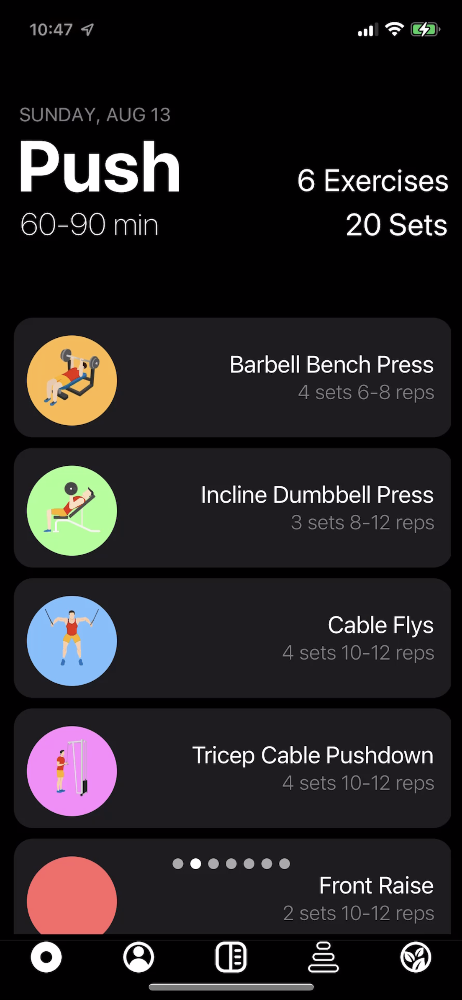
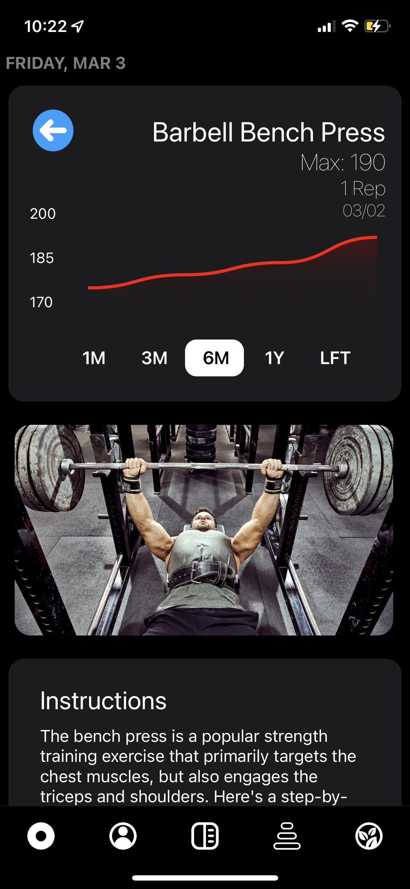

# Welcome

Welcome to Inertia. This is a Fitness app that teaches you the best ways to make progress in the gym and provides you a workout split and meal-plan based on what your goals are.

## Home Page

The home page is where you will see the workout split that was created for you. When setting up your account, the client filters different workout splits based on your goals (strength, hypertrophy, etc), your experience level, and how many days a week you stated you would be free to workout. All of the information about your split is stored in an instance of PostgreSQL which is hosted on Supabase. On the home page below you can view your workout for today and also swipe left to see what your future workouts will look like. Pressing the green "start" button will direct you to a walkthrough of today's workout.

##Edit Workout

Editing your workout is a crucial part of a tracking app and we allow users to modify their workouts with ease. If you want to add an exercise, just scroll to the bottom and press the + button. If you want to reorder your exercises just drag and drop them around. If you want to remove or edit an exercise, you can use the hidden menu to do so.

https://github.com/AnandHalwan/InertiaApp/assets/105897628/692046d8-650b-4529-9c14-335b32cd1d22

## Workout Walkthrough

When doing your workout, Inertia allows you to input the weight and reps that you performed for a particular set and start a rest timer for you. The inputted weight and reps are stored in Supabase along with the current date which is useful data for calculating your progress over time and displaying that progress on a graph which will be shown after this section.

https://github.com/AnandHalwan/InertiaApp/assets/105897628/95e43427-1e58-4202-bcce-79b6ee19ca5e

## Exercise Information

Each exercise has an info screen that can be reached by pressing the little blue "i" icon showed in the above video. The exercise info screen for a particular exercise like bench press displays a graph of your progress over time for that exercise can be filtered by different date ranges. When navigating to this page for a particular exercise, the client app queries Supabase for all of the exercise logs tied to that user and exercise so it can create the graph displayed below. Each exercise info screen also has a link to a video and a well written set of instructions for how to perform that particular exericse correctly.

